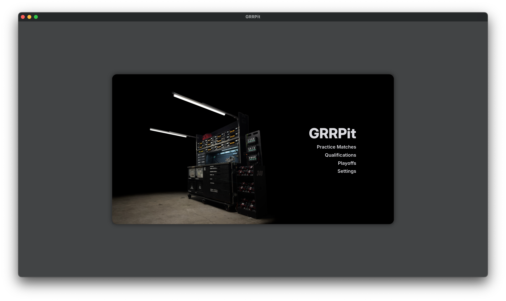
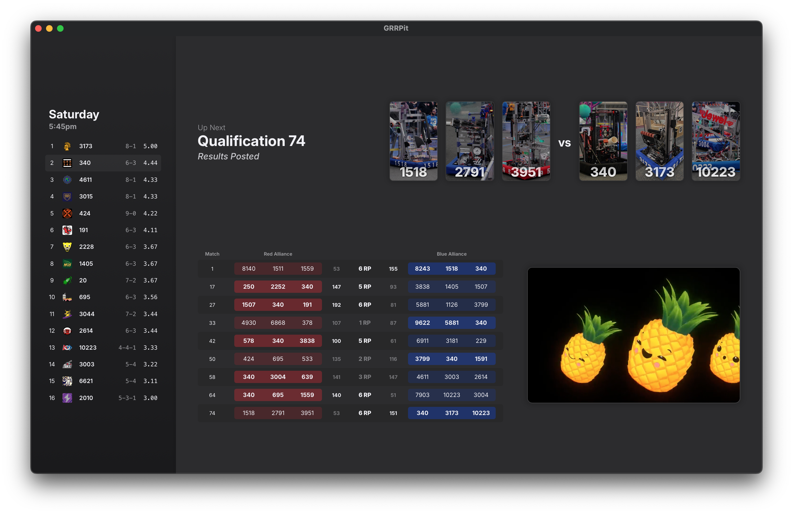

# GRRPit

FRC Team 340's pit display software, built with SvelteKit + Tauri. Data is provided by the FRC Events API, Nexus for FRC, and The Blue Alliance.

### Pre-built Binaries

The latest binaries can be found under this repository's [actions](https://github.com/Greater-Rochester-Robotics/GRRPit/actions), as artifacts produced by CI.

<p>
    
    
</p>

### Building

#### Prerequisites

- [Node.js](https://nodejs.org/en/download) (v22 LTS Recommended)
- [Rust](https://www.rust-lang.org/)

```shell
npm install
npm run tauri build
```

To run the development server:

```shell
npm run tauri dev
```
